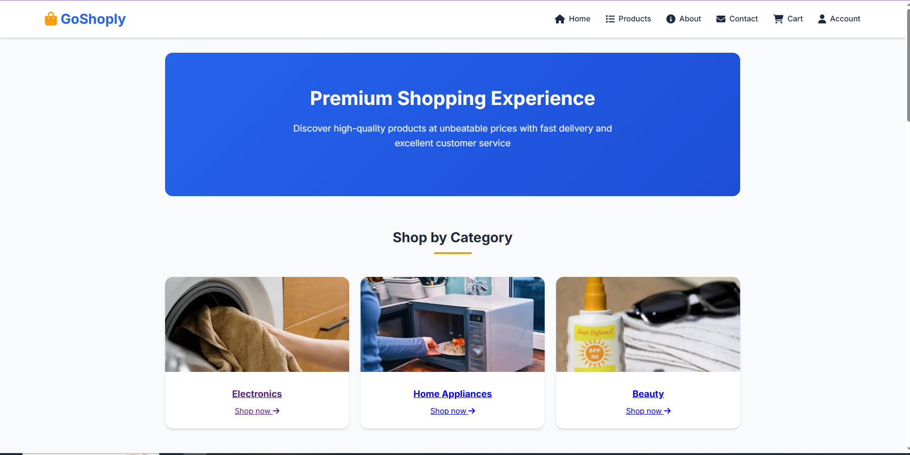

# 🌐 Group Website Project



## 📖 Overview
This project is a collaborative website built by our group using only HTML, CSS, and JavaScript — no frameworks involved. The site emphasizes a clean, responsive design, intuitive user experience, and accessibility. It reflects our shared effort to create a functional and visually engaging web presence using core web technologies.

## 🚀 Features
- ✅ Fully responsive layout for mobile, tablet, and desktop
- 🎨 Modern and clean user interface
- 🧭 Smooth navigation and accessibility features
- ⚡ Optimized for performance and SEO basics
- 🧱 Modular file structure for ease of maintenance

## 🛠️ Built With
- **HTML5** – Semantic structure
- **CSS3** – Styling and layout
- **JavaScript (Vanilla)** – Dynamic behaviors and interactions
 - **PHP** – For backend features

## 📂 Getting Started

To view the website locally, you have two options:

### 🔁 Option 1: Clone the Repository
```bash
git clone https://github.com/margaretnduta/goshoply
```

Open the folder and launch the `index.html` file in your browser.

### 📦 Option 2: Download as ZIP
1. Go to the [repository page](https://github.com/margaretnduta/goshoply)
2. Click the green **"Code"** button
3. Select **"Download ZIP"**
4. Extract the contents and open `index.html` in your browser

No installation required — works right out of the box!

## 👥 Contributors
This website is the result of a group effort. Huge thanks to our dedicated team:
- [Name 1](https://github.com/Margaretnduta)
- [Name 2](https://github.com/martinaperes)

## 📷 Screenshots
Replace the URL below with a hosted image of your project in action:
```

```


## 🧭 File Structure
```
├── index.html
├── /css
│   └── style.css
├── /js
│   └── script.js
├── /images
│   └── screenshot.png
```

## 📬 Contact
For questions or collaboration inquiries, feel free to reach out:
- 📧 Email: [margaretwambui294@gmail.com]
- 🌐 GitHub: [@your-username](https://github.com/margaretnduta)

---

> 🚧 _We’re actively improving the site — stay tuned for updates and enhancements!_
